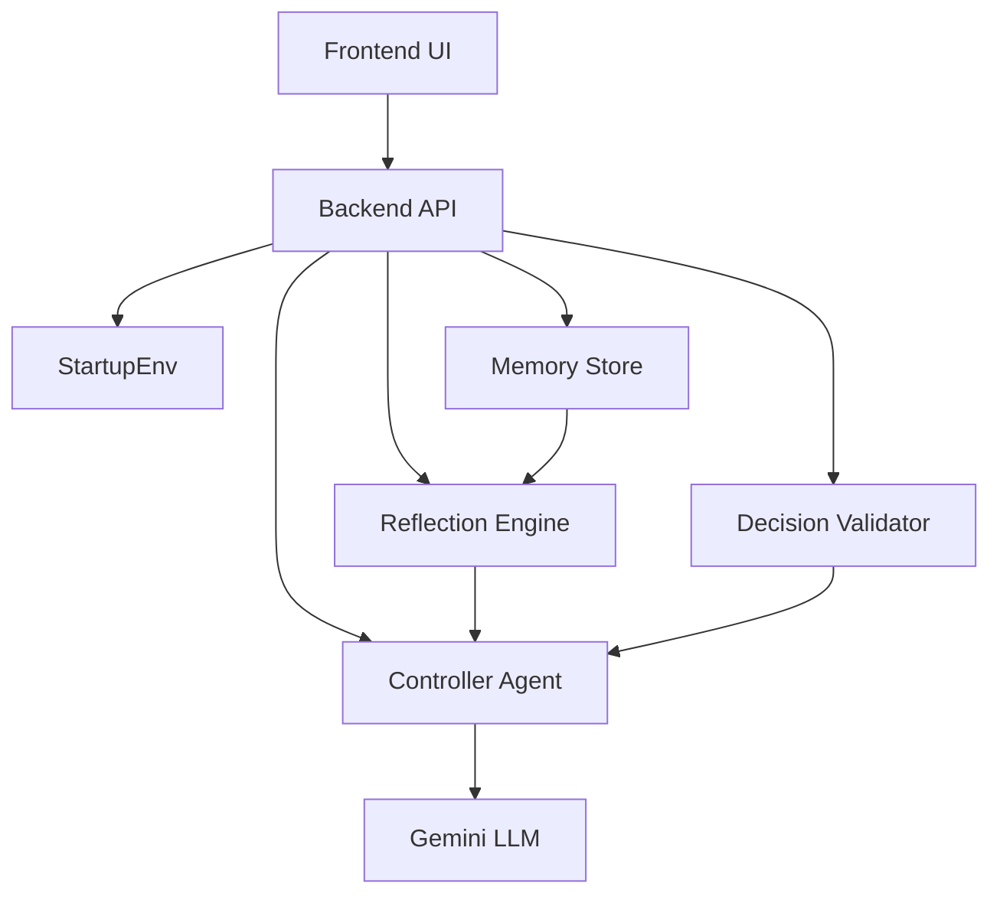

# Self-Improving Autonomous Startup Lab

A multi-agent simulation system where autonomous agents learn to make better decisions through reflection, memory, and validation. Agents manage competing startups in a dynamic market, learning to maximize profit while avoiding costly mistakes.

## 🚀 Quick Start

### Prerequisites
- Python 3.10+ recommended
- Node.js 18+ recommended
- Docker Desktop (optional, for containerized run)
- Gemini API Key (optional unless `USE_LLM_AGENT=true`)

### 1. Clone and Setup

```bash
git clone <repository-url>
cd Startup_Lab_ENV
```

### 2. Set Up Python Environment

```bash
# Create virtual environment
python -m venv venv

# Activate virtual environment
# On Windows:
venv\Scripts\activate
# On macOS/Linux:
source venv/bin/activate

# Install dependencies
pip install -r requirements.txt
```

### 3. Configure Environment Variables

Create a `.env` file in the root directory:
```
GEMINI_API_KEY=your_gemini_api_key_here
USE_LLM_AGENT=false
```

Or copy from example:
```bash
cp .env.example .env
```
Then edit `.env` with your Gemini API key.

### 4. Set Up Frontend

```bash
cd frontend
npm install
cd ..
```

### 5. Run the Application

**Terminal 1 - Backend (FastAPI Server):**
```bash
# Make sure you're in the root directory with venv activated
python -m uvicorn backend.app:app --host 127.0.0.1 --port 8002 --reload
```

**Terminal 2 - Frontend (Vite Dev Server):**
```bash
cd frontend
npm run dev
```

If your backend runs on another port, set:
```bash
# frontend/.env
VITE_API_BASE_URL=http://127.0.0.1:8002
```

### 6. Open in Browser

- **Frontend UI:** http://localhost:5173 (or next available port shown in terminal)
- **Backend API:** http://127.0.0.1:8002
- **API Docs:** http://127.0.0.1:8002/docs (Swagger UI)

## 🐳 Run With Docker

From the repository root:

```bash
docker compose build
docker compose up
```

Services:
- Frontend: http://localhost:5173
- Backend API: http://localhost:8001
- API docs: http://localhost:8001/docs

Notes:
- `docker-compose.yml` loads `.env` for backend secrets/config.
- Frontend container uses `VITE_API_BASE_URL=http://localhost:8001`.
- Stop containers with `docker compose down`.

## 📋 Project Structure

```
.
├── backend/                    # FastAPI application
│   └── app.py                 # Main backend server with endpoints
├── frontend/                  # React + Vite application
│   ├── src/
│   │   ├── App.jsx           # Main React component
│   │   ├── api.js            # API client
│   │   ├── components/       # Reusable components
│   │   │   ├── Dashboard.jsx # State & action display
│   │   │   └── Graph.jsx     # Reward visualization
│   │   └── main.jsx          # Entry point
│   ├── vite.config.js        # Vite configuration
│   ├── tailwind.config.js    # Tailwind CSS config
│   └── package.json          # Frontend dependencies
├── agents/
│   ├── controller_agent.py   # LLM-powered decision maker
│   └── validator.py          # Decision validation guardrails
├── env/
│   └── startup_env.py        # Multi-startup simulation environment
├── memory/
│   ├── episodic_store.py     # Experience storage & retrieval
│   └── reflection.py         # Learning insights generation
├── models/
│   └── model_interface.py    # Gemini API wrapper
├── rewards/
│   └── reward_function.py    # Reward calculation
├── training/
│   ├── train.py              # Training pipeline
│   ├── config.py             # Training configuration
│   └── training_output/      # Checkpoints and results
├── tests/
│   └── test_agent.py         # Unit tests
├── requirements.txt          # Python dependencies
└── openenv.yaml              # Environment specification
```

## 🎮 How It Works

### The Problem
Traditional AI agents struggle with long-term decision making because they:
- Repeat the same mistakes
- Don't learn from failures
- Lack strategic reasoning about consequences

### The Solution

The system implements a **multi-component learning architecture**:



#### Components:

1. **StartupEnv** (`env/startup_env.py`)
   - Simulates 2 competing startups
   - Market demand fluctuates
   - Better quality captures larger market share
   - Actions have costs and benefits

2. **ControllerAgent** (`agents/controller_agent.py`)
   - Uses Gemini LLM to decide actions
   - Receives learning insights from reflection engine
   - Adapts strategy based on past failures
   - Fallback: Safe default actions if LLM fails

3. **DecisionValidator** (`agents/validator.py`)
   - Enforces business logic guardrails
   - Prevents expensive actions when cash is low
   - Detects and avoids repeated failures
   - Maintains action diversity

4. **EpisodicMemory** (`memory/episodic_store.py`)
   - Stores state-action-reward tuples
   - Retrieves recent experiences (last N steps)
   - Finds similar past situations using distance metrics
   - Max capacity: 2000 experiences (configurable)

5. **ReflectionEngine** (`memory/reflection.py`)
   - Analyzes experiences for patterns
   - Generates human-readable insights:
     - "Action X failed 3 times - avoid it"
     - "Cash < $40K causes failures - save more"
     - "Recent momentum is positive - continue strategy"
   - Updates every 5 steps

## 🎯 API Endpoints

### Get Current State
```bash
GET /state
```
Returns: Current simulation state, actions, rewards, insights

### Run One Step
```bash
POST /step
Content-Type: application/json

{
  "actions": null,      // null = auto-decide, or ["action1", "action2"]
  "mode": "trained"     // "trained" or "baseline"
}
```
Returns: Next state, rewards, insights, reasoning for each action

### Get Logs
```bash
GET /logs
```
Returns: Full history of all steps, rewards, and insights

## 📊 Simulation Dynamics

### Actions Available
| Action | Cost | Benefit | Best For |
|--------|------|---------|----------|
| `build_product` | $7,000 | +6 quality | Long-term growth |
| `improve_quality` | $4,000 | +3 quality | Mid-term advantage |
| `run_marketing` | $5,000 | +8 market demand | Scaling sales |
| `reduce_price` | $1,000 | Increases volume | Quick revenue |
| `analyze_market` | $500 | Gather data | Low-risk learning |

### Revenue Model
- Revenue = (market_demand × quality_share × 120)
- Quality share = your_quality / (quality1 + quality2)
- Market demand fluctuates with random events

### Reward Calculation
- Reward = (revenue - action_cost) / 1000
- Agents learn from positive/negative rewards

## 🧠 Training Workflow

See `training/train.py` for the full training pipeline:

1. **Baseline** (5 episodes): Random actions
2. **Agent Learning** (500+ episodes): LLM-based decisions with memory
3. **Comparison**: Evaluate improvement vs. baseline

```bash
python -m training.train
```

This generates checkpoints and training results in `training/training_output/`

## 🔧 Configuration

### Environment Variables
- `GEMINI_API_KEY`: Your Google Gemini API key (required only when `USE_LLM_AGENT=true`)
- `USE_LLM_AGENT`: Enable LLM agent (`"true"`/`"false"`, default `"false"`)
- `VITE_API_BASE_URL`: Frontend API target (example: `http://127.0.0.1:8002`)

### Simulation Config (`openenv.yaml`)
- `max_steps`: Episode length (default: 50)
- `num_startups`: Number of competing startups (default: 2)
- `initial_cash`: Starting budget (default: $100,000)

### Backend Config
- Local host: `127.0.0.1`
- Local recommended port: `8002` (avoids common Windows 8001 conflicts)
- Docker port: `8001`
- CORS: Allows frontend on ports 5173-5179

### Frontend Config
- Dev server port: `5173` (auto-increments if taken)
- Build command: `npm run build`
- Preview: `npm run preview`

## 🐛 Troubleshooting

### Backend won't start
```bash
# Check if port 8001 is in use
lsof -i :8001  # macOS/Linux
netstat -ano | findstr :8001  # Windows

# Kill process or use different port:
python -m uvicorn backend.app:app --port 8002
```

### GEMINI_API_KEY error
```bash
# Verify .env file exists in root directory
cat .env

# Make sure it's not empty:
echo "GEMINI_API_KEY=your_key_here" > .env
```

### Frontend can't connect to backend
```bash
# Verify backend is running on 8001:
curl http://localhost:8001/state

# If CORS error, check allowed origins in backend/app.py
```

### Node modules errors
```bash
cd frontend
rm -rf node_modules package-lock.json
npm install
```

## 📈 Expected Results

After running ~20 steps, you should observe:

1. **Learning Curve**: Agents improve decision quality
2. **Error Reduction**: Fewer mistakes despite challenging decisions
3. **Strategy Shift**: Agents adapt to market conditions
4. **Memory Impact**: Better decisions from past experience

Example output:
```
Step 5: Reward: 12.3, Action: analyze_market
Step 10: Reward: 18.5, Action: improve_quality (learned from reflection)
Step 15: Reward: 25.1, Action: run_marketing (market demand is high)
Step 20: Reward: 22.8, Action: analyze_market (conservative due to low cash)
```

## 🚦 Testing

Run unit tests:
```bash
pytest tests/
```

## 📝 Features

✅ Multi-agent startup simulation  
✅ LLM-powered autonomous decision making  
✅ Memory with episodic experience storage  
✅ Reflection engine for insight generation  
✅ Decision validation with guardrails  
✅ Real-time reward tracking  
✅ Interactive web UI  
✅ REST API for integration  
✅ Training pipeline for agent improvement  

## 🔮 Future Enhancements

- [ ] Multiple market segments
- [ ] Competitive agent vs agent battles
- [ ] Semantic memory with embeddings
- [ ] Fine-tuning on training data
- [ ] Advanced visualization dashboards
- [ ] Export/replay functionality
- [ ] Multi-step planning strategies

## 🚀 Publish (GitHub + Hugging Face)

### Push to GitHub
```bash
git add .
git commit -m "Update docs, runtime fixes, and Docker setup"
git push origin <branch-name>
```

### Push to Hugging Face Space (Docker SDK)
1. Create a Docker Space on Hugging Face.
2. Add repository secret `HF_TOKEN` locally (or login once with CLI):
   ```bash
   hf auth login
   ```
3. Add HF remote and push:
   ```bash
   git remote add hf https://huggingface.co/spaces/<username>/<space-name>
   git push hf <branch-name>:main
   ```

If your HF Space should auto-build this repo, keep `docker-compose.yml` plus Dockerfiles in the root repo.

## 📄 License

MIT License - feel free to use and modify

## 🤝 Contributing

1. Create a feature branch
2. Make your changes
3. Add tests if needed
4. Submit a pull request

## 📚 References

- [Gemini API Docs](https://ai.google.dev/)
- [FastAPI Documentation](https://fastapi.tiangolo.com/)
- [React Documentation](https://react.dev/)
- [OpenAI Gym](https://gym.openai.com/) (environment interface inspiration)
