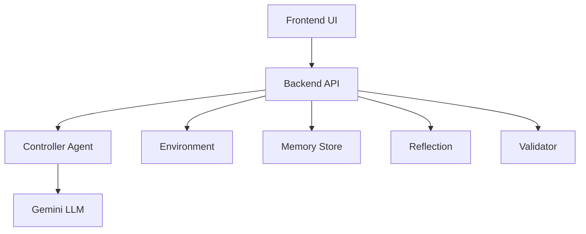

# Self-Improving Autonomous Startup Lab

## Setup

1. **Clone the repository**
   ```bash
   git clone <repository-url>
   cd Startup_Lab_ENV
   ```

2. **Set up environment variables**
   - Copy `.env.example` to `.env` (if exists) or create `.env`
   - Add your Gemini API key:
     ```
     GEMINI_API_KEY=your_api_key_here
     ```

3. **Install Python dependencies**
   ```bash
   pip install -r requirements.txt
   ```

4. **Install frontend dependencies**
   ```bash
   cd frontend
   npm install
   cd ..
   ```

5. **Run the application**
   ```bash
   # Terminal 1: Start backend
   PYTHONPATH=/Users/rajnish_sharma/Startup_Lab_ENV python3 -m uvicorn backend.app:app --host localhost --port 8001 --reload

   # Terminal 2: Start frontend
   cd frontend && npm run dev
   ```

6. **Open browser**
   - Frontend: http://localhost:5179 (or next available port)
   - Backend API: http://localhost:8001

## Problem

AI agents fail in long-term decision making.

## Solution

Multi-agent system with:

- Memory
- Reflection
- Validation
- Gemini reasoning

## Architecture



## Results

- Reward ↑
- Mistakes ↓
- Strategy evolution

## Impact

Real-world decision systems
  - Indexes embeddings in **FAISS** for fast similarity search.
  - Supports retrieval via `search_similar(state, k=3)`.

- **Reflection engine**
  - Groups repeated failures.
  - Detects condition-action anti-patterns (for example, action failures under low cash thresholds).
  - Produces both human-readable insights and structured outputs:

```json
{
  "condition": "cash < 24000",
  "bad_action": "reduce_price",
  "suggestion": "Try run_marketing instead."
}
```

These insights are fed back into controllers to adapt future decisions.

## Training Results

Training workflow in `training/train.py` includes:

1. **Before-training baseline:** 5 episodes with random policy.
2. **Training loop:** multi-episode learning with replay, memory updates, and reflection.
3. **After-training evaluation:** 5 episodes with trained policy.
4. **Action distribution logging** for both baseline and trained runs.

Generated artifacts (saved to `training_output/`):

- `training_results.json`
- model checkpoints and final models
- `reward_plot.png`
- `average_cash_plot.png`
- `unique_strategies_plot.png`

These outputs make it easy to compare policy quality, cash sustainability, and strategic diversity over episodes.

## Demo Scripts

- `scripts/demo.py`: strategy-aware demo with reflection updates and improvement summary.
- `scripts/demo_run.py`: 2-startup/15-step trace with per-step actions, rewards, insights, and `"Strategy change detected"` events.

## Tech Stack

- Python
- NumPy
- Gymnasium
- Matplotlib
- PyTorch / Transformers (for extended training workflows)
- FAISS (vector memory search)

## Quick Start

```bash
python3 -m venv .venv
source .venv/bin/activate
pip install -r requirements.txt
```

Run training:

```bash
python3 training/train.py
```

Run demos:

```bash
python3 scripts/demo.py
python3 scripts/demo_run.py
```

## Future Work

- Replace heuristic planner with LLM-based strategic reasoning.
- Upgrade from tabular Q-learning to deep function approximation with richer state encoding.
- Add long-horizon planning and explicit budget/risk constraints.
- Expand reflection to causal sequence mining (not only condition-action patterns).
- Introduce curriculum scenarios and stress tests (market shocks, demand collapse, adversarial competition).
- Build a dashboard for experiment tracking and side-by-side policy comparison.

## Why This Matters

The core idea is simple but powerful: autonomous agents become significantly more robust when they can remember, retrieve, and reflect on experience.  
This project demonstrates a practical blueprint for self-improving decision systems in dynamic environments.
